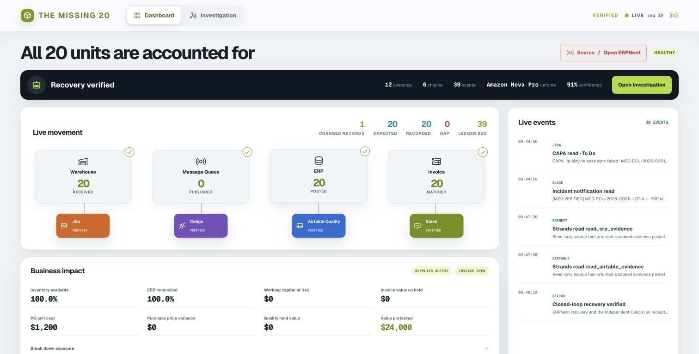
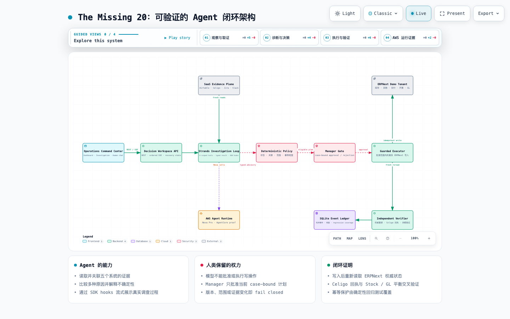

# The Missing 20

**Find the gap. Prove the cause. Close it safely.**

The Missing 20 is an agentic operations control system for supply-chain teams. It
connects fragmented evidence from ERPNext, Airtable, Celigo, Jira, and Slack; lets a
Strands agent investigate the discrepancy; stops for a Manager only when a consequential
recovery is ready; and verifies the result against authoritative business records.

The hero case starts with a 20-unit automotive controller shipment split across two
operational truths: 12 units accepted into Stores and 8 units held for quality review.
The downstream USD 42,000 customer order is neither delivered nor billed. No single
system contains enough evidence to explain the situation safely.



## Why this needs an agent

The visible quantity mismatch is only the symptom. Before anyone retries a receipt,
releases a lot, or posts an invoice, the operator must answer questions spread across
five systems:

- Did the physical shipment arrive, and do Stock Ledger and GL agree?
- Does ERP already contain the integration business key?
- Is the exact supplier lot approved, held, or mismatched?
- Did the Celigo attempt commit, acknowledge, or disappear after a timeout?
- Do Jira and Slack provide context, or only unverified human assertions?
- Is the customer order safe to deliver and bill without creating a duplicate effect?

The Strands loop performs that evidence work. Deterministic code—not the model—owns
state classification, action eligibility, approval binding, execution, verification,
and replay safety.

## The five-minute judge path

1. **Detect** — an external demo-system change advances the source version and the
   ordered event ledger; the Dashboard never animates invented traffic.
2. **Investigate** — Strands runs six bounded read/reconciliation tools, reconciles records, tests
   competing causes, and streams SDK hooks, evidence, latency, tokens, and uncertainty.
3. **Ask** — the operator holds a multi-turn, case-scoped conversation with the Agent
   and can open every cited source record.
4. **Decide** — deterministic policy prepares one exact recovery packet. The Manager
   may approve or reject; stale evidence fails closed.
5. **Recover** — the guarded executor applies only the approved, idempotent ERPNext
   demo-tenant execution bundle.
6. **Verify** — fresh provider reads prove 20/20 delivered, Sales Order
   `SAL-ORD-2026-00006`, Delivery Note `MAT-DN-2026-00001`, Sales Invoice
   `ACC-SINV-2026-00006`, USD 42,000 billed, balanced Stock/GL entries, and the exact
   Celigo run receipt. Duplicate protection is covered separately by deterministic
   idempotency regression tests; this live capture does not claim a second replay attempt.

## Architecture



The main path is intentionally asymmetric:

- **Strands + Nova Pro** investigate, retrieve, reconcile, evaluate, and explain.
- **Deterministic policy** independently reconstructs the admissible business facts.
- **Manager Gate** retains the stop-or-release decision for a bound plan.
- **Guarded Executor** has the only write path and accepts only the approved scope and
  idempotency key.
- **Independent Verifier** closes the case only after authoritative ERPNext rereads,
  Celigo receipt correlation, and ledger checks.
- **SQLite + ordered SSE** make the workflow durable, replayable, and visible in both
  browser views.

Explore the [interactive architecture](docs/architecture/the-missing-20-live-architecture.html)
or read the [as-built architecture](docs/architecture/as-built-architecture.md). The
AgentCore Runtime deployment is separately proven; the current local hero UI uses
direct Strands Bedrock transport and does not pretend to route through AgentCore.

## What is genuinely connected

| System | Evidence or effect in the hero case | Authority |
| --- | --- | --- |
| ERPNext / Frappe Cloud | PO, receipt, lot, supplier invoice, customer order, delivery, sales invoice, Stock Ledger, GL | Fresh reads plus one Manager-gated demo-tenant write path |
| Airtable | Exact-lot supplier-quality disposition | Read-only evidence |
| Celigo | Integration attempt and independently correlated run receipt | Read-only evidence |
| Jira | CAPA/exception ownership and workflow context | Read-only evidence |
| Slack | Human incident context and verified notification | Read-only evidence |
| Amazon Bedrock Nova Pro | Multi-hypothesis investigation and evidence explanation through Strands | Advisory only |
| Amazon Bedrock AgentCore Runtime | Separate READY deployment, invocation, logs, and role-chat proof | Read-only deployment proof |

All enterprise records are purpose-built competition data. The approved ERPNext
execution bundle writes to an isolated external demo tenant and is followed by fresh
provider reads.
No production customer data, production accuracy, AgentCore Gateway/Policy, or causal
revenue-uplift claim is presented.

## How Strands is used

This is not a single prompt wrapped in a dashboard. The implementation includes:

- a bounded investigation orchestrator;
- scoped ERP, registry, integration, and collaboration tools;
- structured/typed advisory output;
- competing hypotheses and explicit stop conditions;
- synthesis and evaluator feedback;
- SDK lifecycle hooks exposed as a flight recorder;
- case-scoped multi-turn conversation with evidence citations;
- a hard boundary that prevents model output from becoming business-write authority.

The current real-provider evidence includes 8/8 ambiguous case variants and 15/15
multi-turn cases (45 dialogue turns), including approve, reject, deny, and
needs-evidence outcomes. These are bounded demo-set results, not a production SLO.

## Quick start — no cloud credentials required

Prerequisites:

- Python 3.12+
- Node.js 20+
- [`uv`](https://docs.astral.sh/uv/getting-started/installation/)
- GNU `make` (macOS Command Line Tools or a standard Linux build environment)

```bash
git clone https://github.com/danielwanwx/the-missing-20.git
cd the-missing-20
cp .env.example .env
make bootstrap
make case-console
```

Open `http://127.0.0.1:8765`, choose **Live / Inject incident**, then follow
Dashboard → Investigation → conversation → Manager decision → verification.

The default path uses deterministic synthetic source fixtures and makes no AWS or
third-party provider call. It is the reproducible judge path. Keep the generated
`.missing20-runtime` directory to verify recovery across a server restart.

### Real Strands / Nova mode

With an authorized AWS profile and purpose-built external demo records configured in
`.env`:

```bash
AWS_CONFIRM=1 make case-console-judge
```

The application fails visibly as `DEGRADED` if the provider is unavailable; it never
substitutes a scripted model conclusion. External writes remain disabled unless
`MISSING20_ENVIRONMENT=demo` and the exact Manager-gated executor preconditions pass.

### Stop and reset

- Stop the server with `Ctrl-C`.
- Preserve `.missing20-runtime` to test durable recovery.
- For a fresh local run, use a new runtime directory:

```bash
CASE_CONSOLE_RUNTIME=.missing20-runtime-fresh make case-console
```

## Verification

Run the release-quality gate:

```bash
make check
make golden
make golden-v2
make workspace-smoke
make judge-demo
```

Targeted proof:

| Proof | Evidence |
| --- | --- |
| Browser and end-to-end workflow | [`artifacts/workspace/browser-smoke-v1.json`](artifacts/workspace/browser-smoke-v1.json) |
| Real Strands multi-case evaluation | [`artifacts/agent/2026-09-06-hybrid-loop-8-case-real.json`](artifacts/agent/2026-09-06-hybrid-loop-8-case-real.json) |
| Human/Agent dialogue matrix | [`artifacts/agent/2026-09-06-human-agent-dialogue-matrix-final-v2.json`](artifacts/agent/2026-09-06-human-agent-dialogue-matrix-final-v2.json) |
| Manager-gated external ERPNext recovery | [`artifacts/audits/2026-09-07-current-hero-proof.json`](artifacts/audits/2026-09-07-current-hero-proof.json) + [hash-bound raw live capture](artifacts/audits/2026-09-07-current-hero-live-snapshot.json) |
| AgentCore Runtime proof | [`artifacts/aws/2026-08-29-agentcore-runtime-proof.json`](artifacts/aws/2026-08-29-agentcore-runtime-proof.json) |
| Final independent judge review | [`artifacts/audits/2026-09-07-role-judge-rerun/final-verification.md`](artifacts/audits/2026-09-07-role-judge-rerun/final-verification.md) |
| Claim boundary | [`docs/submission/evidence-matrix.md`](docs/submission/evidence-matrix.md) |

## Failure behavior

- `?mode=degraded` — the advisory provider is unavailable; deterministic truth stays
  visible, but no diagnosis is fabricated and no recovery is unlocked.
- `?mode=invalid` — authoritative lifecycle evidence is incomplete; operational claims
  and controls fail closed.
- Rejecting the Manager plan records the decision and creates zero external effects.
- Duplicate-effect protection is covered by deterministic regression tests. The
  committed live hero capture proves one Manager-approved bounded execution bundle
  producing the captured record set, not a separate replay.

## Repository map

```text
src/the_missing_20/       agent, policy, adapters, ledger, evaluation
scripts/                  server, seeders, smoke and evidence runners
workspace/                production dashboard and investigation UI
tests/ + tests-js/        unit, integration, browser and contract tests
docs/architecture/        validated architecture and as-built explanation
docs/submission/          Devpost copy, judging map, evidence and limits
artifacts/                redacted machine-readable proof and judge captures
```

## Security and authority

- Credentials remain in ignored `.env` files and never reach the browser.
- Source tools are allowlisted and read-only.
- Model output is parsed as untrusted data and is not policy input.
- The only external write path is case-bound, Manager-gated, idempotent, and restricted
  to exact M20 records in the isolated ERPNext demo tenant.
- The local Manager is a declared demo persona, not an authentication claim.

See [known limitations](docs/submission/known-limitations.md) and
[project provenance](docs/provenance.md) for the complete claim boundary.

## Competition materials

- [Devpost submission draft](docs/submission/devpost-submission-draft.md)
- [Five-minute demo script](docs/demo/five-minute-demo.md)
- [Judging map](docs/submission/judging-map.md)
- [System overview](docs/submission/system-overview.md)
- [Official-requirements and prior-winner benchmark](docs/research/2026-09-07-submission-and-winner-readme-benchmark.md)

## Built with

Strands Agents SDK · Amazon Bedrock Nova Pro · Amazon Bedrock AgentCore Runtime ·
ERPNext/Frappe Cloud · Airtable · Celigo · Jira · Slack · Python 3.12 · Pydantic ·
SQLite · Server-Sent Events · Vanilla JavaScript/CSS

## License

[MIT](LICENSE)
