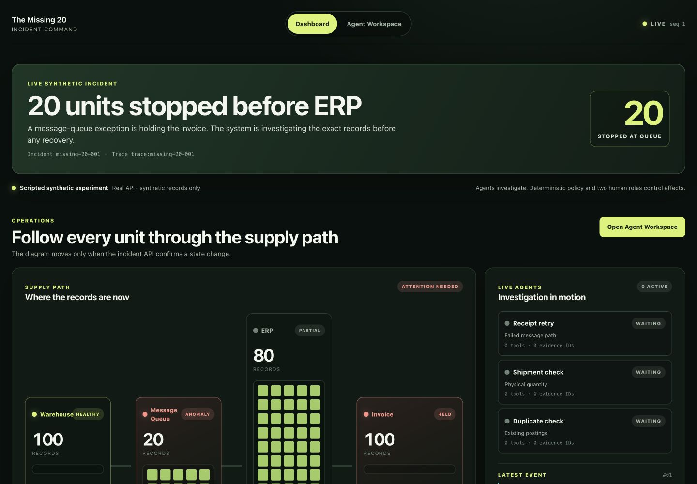
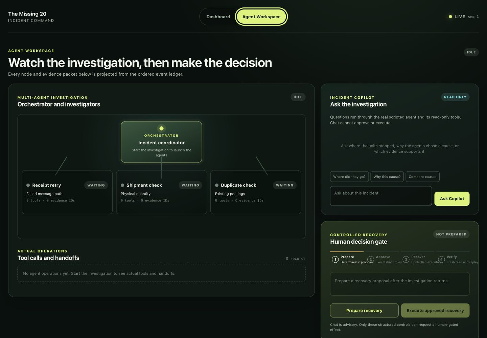
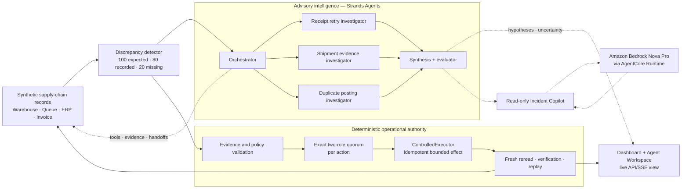

# The Missing 20 — Agents for Humans

**Find the gap. Prove the cause. Close it safely.**

The Missing 20 is a live, guided supply-chain incident investigation for operations
teams. The story is concrete: the warehouse expects 100 units, the ERP records 80,
and the system must explain the missing 20 before anyone changes a record.

Three specialized Strands investigators work in parallel with an orchestrator. They
call read-only evidence tools, compare competing causes, and hand findings to a
synthesis/evaluation stage. The resulting explanation is useful but advisory. A
separate deterministic control path owns evidence integrity, policy, two-role
approval, controlled execution, authoritative reread, verification, and replay. The
local demo uses synthetic data and scripted role principals; it makes no claim of
independent human authentication.





## What a judge sees in five minutes

1. **Detect:** a live Dashboard shows 100 expected, 80 recorded, and the 20-unit gap
   arriving through the local incident API and ordered SSE ledger.
2. **Investigate:** Agent Workspace animates the orchestrator, three investigator
   roles, tool calls, evidence, competing hypotheses, and handoffs.
3. **Ask:** the read-only Incident Copilot answers a current-state question and
   exposes the evidence it used; it cannot approve or execute.
4. **Decide:** deterministic policy prepares an eligible recovery and requests two
   distinct simulated role approvals for that exact action.
5. **Recover:** `ControlledExecutor` applies bounded synthetic effects, rereads the
   authoritative state, verifies 100/100, and proves replay adds zero effects.

This is the product path; the detailed evidence tables are secondary proof for a
judge who wants to inspect the implementation.

## Try the guided replay

Prerequisites: Python 3.12+ and Node.js 20+.

```bash
python3.12 -m venv .venv
make bootstrap PYTHON=.venv/bin/python
make workspace
PYTHONPATH=src .venv/bin/python scripts/decision_workspace_server.py
```

Open the local URL printed by the server. The browser connects to the local experiment
API and ordered SSE event ledger, then waits for an explicit **Start Investigation**
click. The same start control is available on Dashboard and Agent Workspace; after a
completed trace, **Replay Investigation** only re-emits its immutable ledger. A CLOSED
incident cannot start a new investigation. The browser renders all 100 unit records and
keeps two synchronized views:

- **Dashboard:** start or replay the trace, then watch units move through Warehouse,
  Message Queue, ERP, and Invoice as authoritative API events arrive.
- **Agent Workspace:** start or replay the trace, then inspect the orchestrator, three
  investigators, tool calls, evidence, handoffs, and the advisory Incident Copilot.

The complete interaction covers five stages:

1. Detect the 20-unit gap.
2. Compare competing agent hypotheses.
3. Apply deterministic safety rules.
4. Require approval from two distinct simulated role principals.
5. Recover, verify, and prove replay creates no duplicate effect.

The workspace also exposes two explicit failure views:

- `?mode=degraded`: the provider failed, no hypothesis is invented, and deterministic
  protection remains available.
- `?mode=invalid`: authoritative lifecycle evidence is incomplete, so the workspace
  fails closed and hides operational claims.

## Architecture

The diagram shows the boundary that matters: Strands and Nova investigate; deterministic
application code decides whether an operational effect is allowed.



**Authority rule:** model output can explain, compare, and identify evidence gaps. It
cannot classify authoritative state, authorize an action, execute an effect, verify a
result, or replay an operation. The local demo client is unauthenticated and its role
approvals are scripted test principals.

## Why this is different

Most agent demos stop at a plausible answer. The Missing 20 separates investigation
from authority:

- Strands agents may propose hypotheses, retrieve synthetic knowledge, identify gaps,
  and prepare an incident explanation.
- Deterministic code alone owns evidence integrity, state classification, action
  eligibility, policy, execution, verification, and replay.
- Every controlled action requires an exact two-role quorum.
- The executor rereads authoritative state, applies a bounded idempotent effect,
  verifies postconditions, and records a zero-effect replay.

The Incident Copilot is advisory and read-only. Operational controls are a separate,
fail-closed path limited to local synthetic state: prepare a deterministic proposal,
collect approvals from two distinct simulated role principals, execute through
`ControlledExecutor`, then verify the authoritative reread and replay. The default
local demo and package-generation path makes no provider call, loads no remote
resource, and cannot write to an external system. A separately configured real
AgentCore Runtime path is read-only and is represented by redacted evidence below.

## Evidence boundary

| Capability | Current evidence |
| --- | --- |
| Detection, policy, per-action quorum, execution, verification, replay | **Proven locally** with synthetic data |
| Strands multi-agent investigation | **Proven locally as a scripted synthetic trace**: orchestrator + 3 fixed investigators, audited tools, evidence, handoffs, synthesis, and evaluation |
| Amazon Bedrock Nova Pro / AgentCore advisory | **Partial** real investigation: 3 investigators completed; AI citation coverage 1/5; application validation 5/5 |
| AgentCore Runtime | **Proven**: READY direct-code deployment, real invocation, read-only role chat, runtime logs, and observed trace-delivery warning |
| AgentCore Gateway and Policy | **Not proven** |
| Stable useful real-provider investigation | **Not proven**; the real multi-agent result is disclosed as partial |

The real AgentCore run is preserved as a redacted partial result: Nova selected the
likely retryable-message cause, while deterministic application code independently
validated all five admitted records. AgentCore Runtime proves the deployment boundary,
not Gateway, Policy, stable model usefulness, or production business impact. All
records, runbooks, incidents, and business data in this repository are synthetic; no
employer or customer material is admitted.

## Verification

Run the complete local quality and competition-package gates:

```bash
make check
make golden
make golden-v2
make workspace-smoke
make judge-demo
```

`make judge-demo` regenerates the lifecycle, workspaces, and package audit in a clean
temporary state. It does not make an AWS or model call. A separate 2026-08-30
acceptance run exercised the deployed AgentCore Runtime with one real multi-agent
investigation and one real role chat. The cumulative known engineering estimate is
`$0.2240576`; transport cycles are not described as model calls, and this is not an
AWS invoice.

## Competition materials

- [Five-minute demo card](docs/demo/five-minute-demo.md)
- [Judging map](docs/submission/judging-map.md)
- [Evidence matrix](docs/submission/evidence-matrix.md)
- [Known limitations](docs/submission/known-limitations.md)
- [Competitive benchmark](docs/submission/competitive-benchmark.md)
- [Provenance](docs/provenance.md)

The repository is prepared for development review. Public video upload and Devpost
submission remain separate human-controlled release actions.

## Built with

- **Strands Agents SDK:** orchestrated multi-agent investigation, audited read tools,
  structured investigator/synthesis outputs, streaming lifecycle events, and the
  read-only conversational role chat.
- **Amazon Bedrock Nova Pro + AgentCore Runtime:** a redacted real deployment and
  invocation proof for the advisory boundary; no write tools are exposed.
- **Python, SQLite, and ordered SSE:** deterministic case/effect ledger, lifecycle
  validation, local incident API, and live browser data flow.
- **Vanilla JavaScript and CSS:** Dashboard and Agent Workspace with animated flow,
  evidence handoffs, chat, approvals, verification, and replay states.

## Project status

`PRIVATE_READY_TO_BE_JUDGED` — the local product, tests, redacted AWS evidence, and
English submission materials are prepared. The five-minute video and Devpost entry
are still pending the final release gate. The product
does not claim Gateway/Policy usage, stable real-Nova usefulness, or production
business impact. See [`docs/submission/devpost-submission-draft.md`](docs/submission/devpost-submission-draft.md)
for the field-ready English draft.

## License

[MIT](LICENSE)
