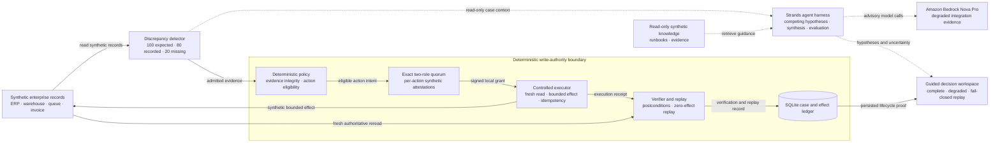

# As-Built Architecture

This diagram describes the implementation in this repository. It intentionally excludes
unimplemented AgentCore, DynamoDB, Cognito, and KMS components.

## Evidence boundary

| Component | Current evidence |
| --- | --- |
| Detection, policy, exact quorum, execution, verification, and replay | Proven locally with synthetic data |
| Strands multi-agent orchestration and tools | Implemented; useful hero trace is scripted synthetic proof |
| Amazon Bedrock Nova Pro | Connectivity and degraded-outcome observability only |
| Stable useful real-provider investigation | Not proven |
| AgentCore Runtime, Gateway, Policy, Observability, or deployment | Not implemented and not claimed |

## Authority rule

Agent output can propose hypotheses, retrieve knowledge, identify evidence gaps, and
prepare an explanation. It cannot classify authoritative state, authorize an action,
execute an effect, verify a result, or replay an operation. Those responsibilities stay
inside deterministic code and require exact two-role approval before any synthetic
effect is applied.
