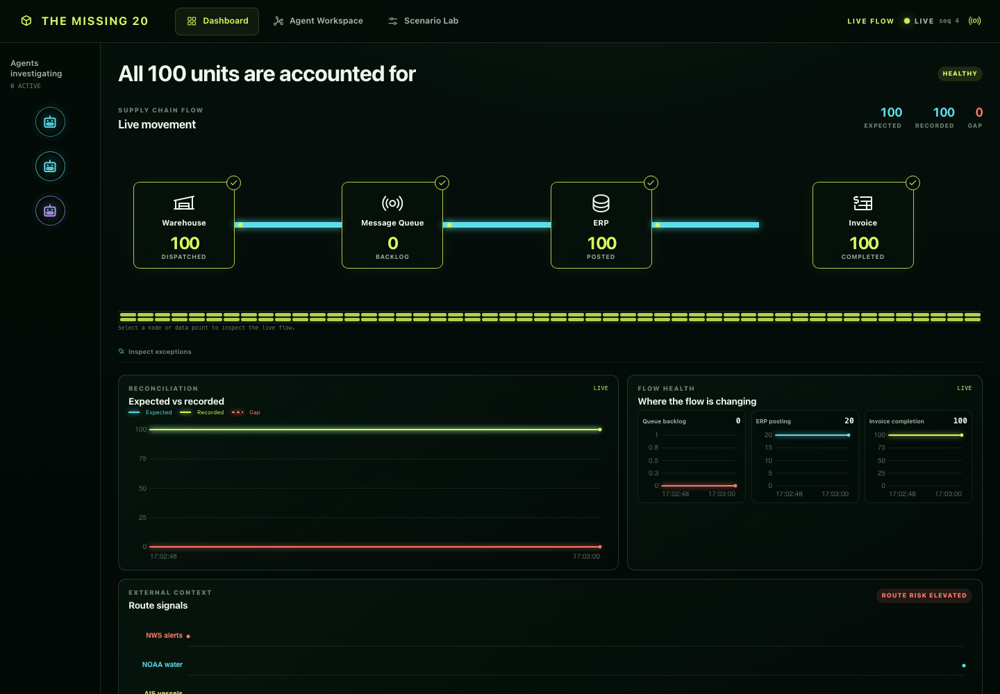
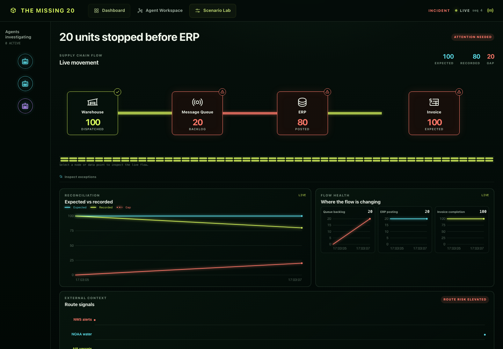
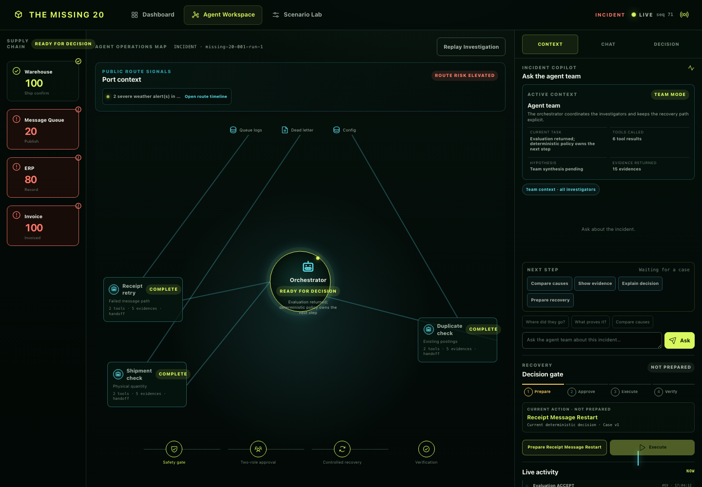
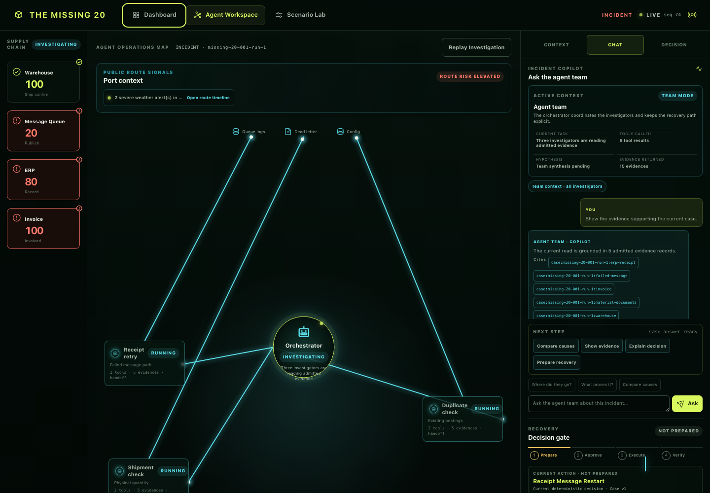
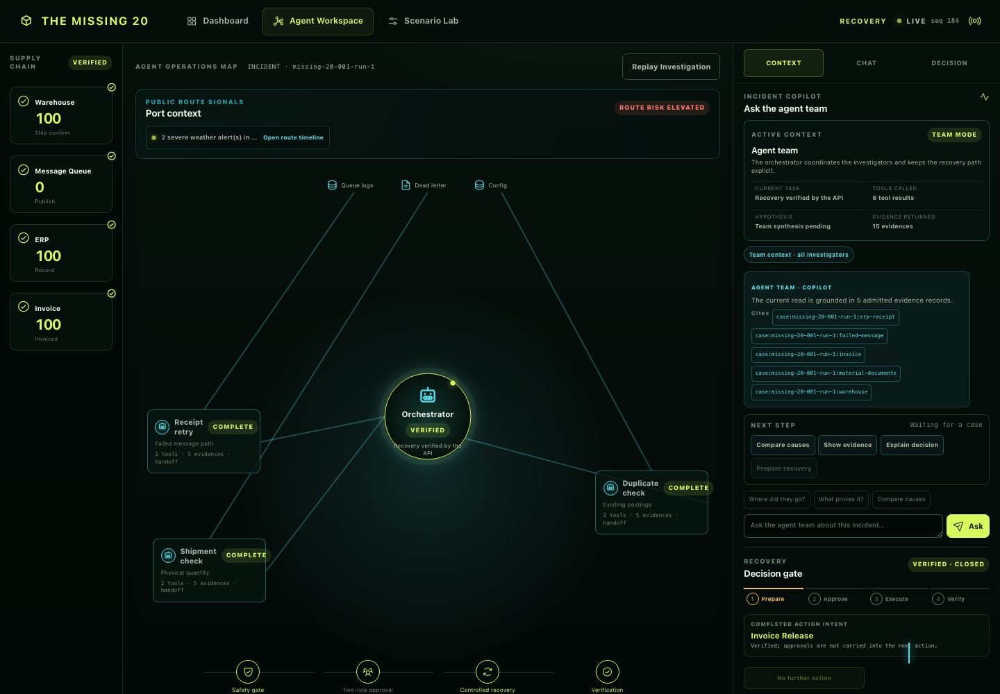
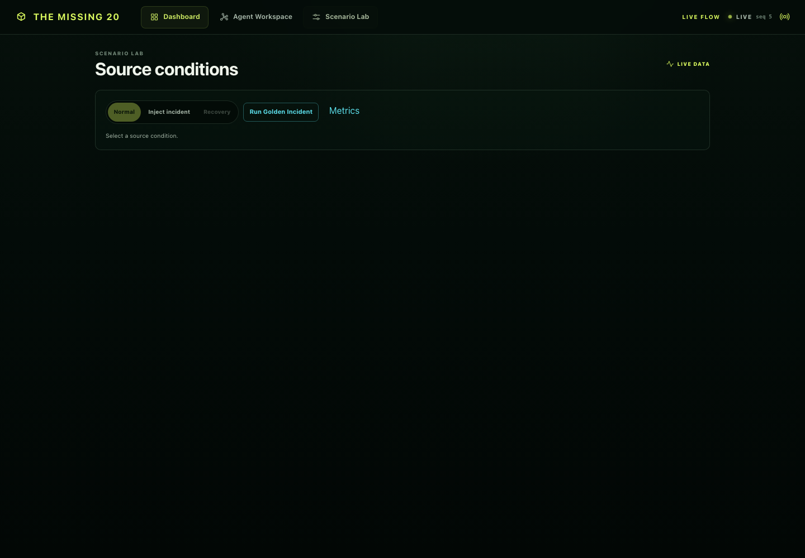
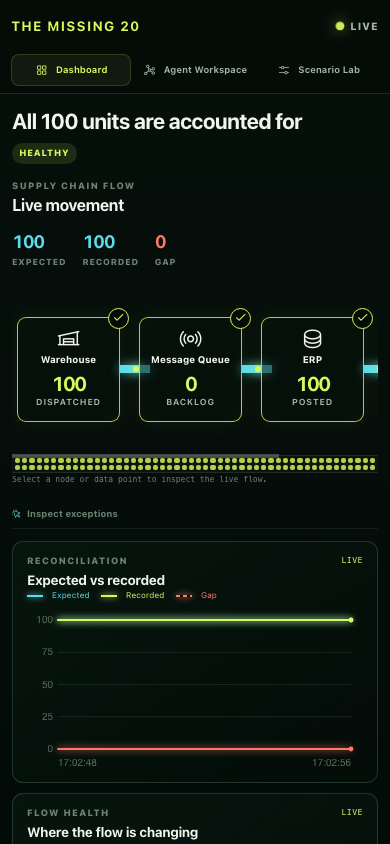

# The Missing 20: final independent award review

Date: 2026-08-29
Reviewer: **Independent Enterprise AI Operations Judge** — incident commander, supply-chain control-tower product lead, observability UX reviewer, accessibility reviewer, and Devpost Stage-Two judge.
Scope: read-only review of the Phase-2 worktree against the approved design, original 100-point rubric, and the three user-selected dark control-tower references.

## Verdict

**REJECT_FINAL — 84/100.**

The product is now a credible, visually differentiated control tower. The four coordinated Dashboard stories, orchestrator-centered Agent Workspace, real API/SSE truth, state-aware closed-case answer, deterministic two-role recovery, verification, and immutable replay are all real and materially stronger than the first audit. It is not yet ready to put in front of judges because four reproducible acceptance defects remain: the Agent Workspace keyboard tab leaks into the global navigation, citation focus does not visibly land, the five-chart keyboard contract has an SSE race, and the packaged five-minute demo is currently blocked by a stale competition audit.

There is no P0 product-direction defect. The recommendation is one bounded reliability/acceptance correction, not another redesign.

## Review authority and evidence

The standards baseline remains the primary-source set documented in the original audit: [official competition rules](https://agentsforhumans.devpost.com/rules), [Datadog Bits Investigation](https://www.datadoghq.com/product/ai/bits-investigation/), [FourKites Intelligent Control Tower](https://www.fourkites.ai/platform), [project44 visibility](https://www.project44.com/platform/visibility/), [Grafana dashboard best practices](https://grafana.com/docs/grafana/latest/visualizations/dashboards/build-dashboards/best-practices/), and [AWS AgentCore / Strands](https://aws.amazon.com/blogs/machine-learning/get-to-your-first-working-agent-in-minutes-announcing-new-features-in-amazon-bedrock-agentcore/). Confidence is high for the competition and product principles and medium for visual comparison to prior winners, because no comparable corpus of winning repositories/videos was established.

Fresh local evidence:

- Browser probe: [`final-browser-evidence.json`](../../artifacts/audits/2026-08-29-award-ui-final-review/final-browser-evidence.json)
- Closed/replay probe: [`closed-browser-evidence.json`](../../artifacts/audits/2026-08-29-award-ui-final-review/closed-browser-evidence.json)
- Stable citation probe: [`citation-focus-probe.json`](../../artifacts/audits/2026-08-29-award-ui-final-review/citation-focus-probe.json)
- One failed and one passing isolated full smoke: [`fresh-smoke-flake.txt`](../../artifacts/audits/2026-08-29-award-ui-final-review/fresh-smoke-flake.txt)
- Passing smoke snapshot: [`browser-smoke-pass-snapshot.json`](../../artifacts/audits/2026-08-29-award-ui-final-review/browser-smoke-pass-snapshot.json)
- Phase-2 implementation report: [`2026-08-29-award-ui-phase2-implementation.md`](2026-08-29-award-ui-phase2-implementation.md)

The browser requested only localhost assets/APIs. No AWS/provider call, spend, commit, push, or publish was performed.

## Fresh visual evidence

### Dashboard





### Agent Workspace







### Scenario and mobile





## 100-point score

| Dimension | Score | Independent assessment |
|---|---:|---|
| Data story / diagram quality | **19/20** | Exactly four coordinated data stories are present: live topology, reconciliation, three flow-health small multiples, and external route context. API/SSE values, topology counts, timestamps, units, source, and freshness are inspectable. |
| Agent capability legibility | **18/20** | Orchestrator, three roles, evidence/tool counts, handoffs, safety gate, approval, controlled execution, verification, chat, and replay are visually legible. Generic status-only agent icons in the Dashboard rail remain less informative than the reference. |
| Real-time truth / provenance | **14/15** | Normal 100/100/0, Incident 100/80/20, and Closed 100/100/0 matched authoritative API state; NWS/NOAA remain advisory and browser traffic is localhost-only. The intermittent chart cursor mismatch reduces confidence by one point. |
| Interaction depth / control usefulness | **11/15** | Scenario transition, golden run, role selection, chat, decision controls, approvals, effects, verification, and replay work. Keyboard sub-tabs and citation focus fail exact acceptance. |
| Information hierarchy / copy economy | **8/10** | Dashboard stayed at 142–162 visible words; default active Agent context was 323 and closed was 330. An opened evidence disclosure reached 548 words, but that is user-requested depth rather than default clutter. Scenario Lab remains visually underfilled. |
| Visual polish / motion / responsive | **8/10** | The dark neon visual system now closely matches the chosen references and separates healthy/incident/recovery states well. 390/768/1280/1440 checks passed in the official smoke. Scenario Lab still reads as a sparse utility screen rather than a deliberate source simulator. |
| Accessibility | **3/5** | Responsive layout, focus styles, reduced-motion behavior, semantics, and five chart canvases exist. The nested tablist ArrowRight defect and intermittent chart keyboard race are blocking accessibility regressions. |
| Competition / demo narrative | **3/5** | The product story itself is strong and completes detection → agents → governed recovery → verification → replay. The current packaged judge command blocks before the five-minute path because its audit digest is stale. |
| **Total** | **84/100** | Below the required 88 and not consistently executable as a judge package. |

## Approved-spec verification

| Check | Result | Evidence |
|---|---|---|
| Normal → Incident → Investigation → Approval → Execution → Verification → Recovery → Normal | **PASS** | Fresh full smoke plus closed probe. Effects were `RECEIPT_RESTART` and `INVOICE_RELEASE`; final API state was `CLOSED`, verified, 100 recorded / 0 failed. |
| Exactly four Dashboard data stories, API/SSE-driven | **PASS** | Full smoke reports six diagram DOM IDs representing four coordinated stories and five canvases; incident screenshot shows 100/80/20 and live sequence. |
| Shared cursor, timestamp, unit, source, freshness | **PASS by pointer; FLAKY by keyboard** | Passing snapshot records all five charts. A separate fresh run mismatched focused `invoice-health-chart` with metric `External context`. |
| Three investigators, tools/evidence, handoff, safety, two-role approval, action, verification | **PASS** | Full smoke selected all three central graph role nodes and the orchestrator; lifecycle completed deterministically. |
| Active and closed chat state | **PASS** | Closed question returned “closed and reconciled: 100 of 100” plus the historical 20-unit queue gap and five citations. |
| Every displayed citation opens and visibly focuses matching evidence | **FAIL** | Stable probe found the matching durable evidence and opened the drawer, but no `.evidence-packet.is-focused` target remained and no visible focus result was produced. |
| No dead primary controls | **PASS for pointer; FAIL for keyboard sub-tabs** | Top navigation, scenarios, Golden, roles, case actions, chat, approvals, execute, verify, recovery, and replay changed real state. `ArrowRight` on `Context` switched focus/view to global `Dashboard` instead of `Chat`. |
| Copy budget | **PASS default state** | Dashboard 142–162 words, active Context 323, Closed 330. The 548-word evidence-open state is a disclosure state. |
| 390 / 768 / 1280 / 1440; focus; reduced motion | **PASS layout/motion; FAIL keyboard** | Official smoke reports exact 390 width without overflow and `animation-name:none; duration:0s`. Nested keyboard routing remains broken. |
| Truth/provenance and no browser third-party calls | **PASS** | Browser network list contains only localhost API/assets. Synthetic enterprise versus external advisory context remains explicit. |
| Python / JS / diff / console regression gates | **PARTIAL** | `npm test` 19/19, focused Python suites, and `git diff --check` passed; console was clean. Full browser smoke passed once and failed once on the chart keyboard race. |
| Five-minute no-typing judge path | **FAIL** | `.venv/bin/python scripts/run_judge_demo.py` and `scripts/audit_competition_package.py --check` both block because the private competition audit does not match current package bytes. |

## Reproducible P1 defects

### P1.1 — Agent sub-tab keyboard leaks to global navigation

On the active Agent Workspace, focus `Context` and dispatch physical `ArrowRight`. Expected: `Chat` becomes selected and retains focus. Actual: the global `Dashboard` tab receives focus and the product routes away; the Agent rail remains on `Context`.

Evidence: `rail_keyboard_chat = {active: "tab-dashboard", selected: "rail-tab-context"}` in `final-browser-evidence.json`, plus the captured “chat” screenshot showing Dashboard after the key event.

### P1.2 — Citation opens the drawer but does not visibly focus its target

After the closed chat settles, click the displayed `...:erp-receipt` citation. The exact durable evidence exists and the drawer opens, but the target is not marked/focused and the page exposes no visible focused result. This fails the explicit evidence-closure acceptance criterion and makes a judge search manually.

Evidence: `citation-focus-probe.json` records three matching DOM candidates, `drawer: true`, and `focused: []`.

### P1.3 — Five-chart physical keyboard contract is intermittent

Two consecutive isolated full-browser smokes disagreed. One passed all five charts; one failed while `invoice-health-chart` retained DOM focus but `__chartMeta.metric` reported `External context` and the detail still described invoice completion. That is a real SSE/render race, not a cosmetic assertion.

Evidence: `fresh-smoke-flake.txt` and `browser-smoke-pass-snapshot.json`.

### P1.4 — The distributable five-minute judge path is blocked

The code-level product can complete the lifecycle, but the actual packaged judge command is not runnable from the current worktree: the private audit digest is stale. A judge-ready verdict cannot be issued while the documented demo entry point blocks before the story starts.

Reproduction:

```text
.venv/bin/python scripts/run_judge_demo.py
The Missing 20 private judge demo: BLOCKED (M7 private audit is stale or does not match current package bytes)
```

## Non-blocking P2 notes

- Scenario Lab is truthful and functional, but the large empty canvas looks unfinished beside the dense Dashboard and Agent Workspace. Do not add another feature; compact the lab into a deliberate source-condition card or add a bounded source-flow preview using existing data.
- The Dashboard left rail uses three unlabeled, status-only robot circles. Central Agent graph roles are clickable and clear, but the rail is visually ambiguous. Add visible role names or simplify it to one team-status indicator.
- Compared with the references, the product now matches topology, status color, live lines, orchestrator center, decision rail, and activity narrative. It remains less explicit about tool-to-evidence paths and slightly more dependent on very small monospace copy.

## One bounded correction package

No feature expansion is authorized. Luna should make only these four corrections:

1. **Scope keyboard events to their tablist.** Agent rail `ArrowLeft/Right/Home/End` must update only `Context / Chat / Decision`, call `stopPropagation`, retain Agent Workspace view, and focus the selected rail tab. Global view-tab handling must ignore events originating in a nested tablist.
2. **Make citation landing persistent and testable.** After the response reaches its final render, citation click must open the drawer, place DOM focus on the exact durable evidence record (`tabindex=-1` is acceptable), expose `aria-current` or equivalent, and retain a visible highlight long enough to perceive. Test every displayed citation, including `refresh-*` evidence after Closed.
3. **Remove the chart/SSE key race.** Bind the shared cursor update atomically to the physically focused canvas and its current metric metadata. Run the five physical keys repeatedly under active SSE; focused canvas, metric, detail, and three shared timestamps must agree every time.
4. **Freeze and regenerate the private competition package.** Regenerate the audit only after UI bytes stop changing, then require `audit_competition_package.py --check` and `run_judge_demo.py` to pass from a clean local invocation. Preserve the private/public human gate; do not push or publish in this correction.

## Final acceptance gate

Return **APPROVE_FINAL** only when:

- the four P1 reproductions above are green;
- the full browser smoke passes three consecutive isolated runs under active SSE;
- `npm test`, focused/full Python gates, `git diff --check`, competition audit, and judge demo all pass;
- fresh screenshots still match the approved dark control-tower direction; and
- the rerun score is at least 88/100.

---

## Final correction verification — 2026-08-29

### Verdict after correction

**REJECT_FINAL — 91/100.**

The three product/UI P1 defects are closed. The product now exceeds the 88-point award threshold and all three isolated real-browser lifecycle runs passed. One release-integrity P1 remains: the required competition audit and five-minute judge command fail after the final independent smokes because the audit still hashes the mutable `browser-smoke-v1.json` bytes. Under the agreed gate, a score above 88 cannot override a reproducible P1.

No new product, design, or polish finding was introduced in this verification.

### Exact P1 rerun

| Original P1 | Final result | Fresh evidence |
|---|---|---|
| Nested Agent rail physical keys | **PASS** | Three isolated Chrome runs each report `Context → Chat`, `Chat → Decision`, and `Decision → Context` with the expected selected/focused rail tab and `view: agent`. Events no longer reach global Dashboard navigation. |
| Every displayed citation, including `refresh-*` | **PASS** | Live case: all 5 displayed citations. Closed case: all 10 displayed citations, including five `refresh-4:*` IDs. Every result reports matching `active_id`, `target:true`, `drawer_open:true`, `aria_current:true`, and `focused:true`. |
| Five charts under active SSE | **PASS × 3 isolated runs** | Dashboard, queue, ERP, invoice, and external-risk canvases each retained physical focus, correct metric/detail, numeric freshness, and one aligned timestamp. No recurrence of the invoice/external-context mismatch. |
| Competition audit + five-minute judge command | **FAIL** | Both commands still block after the independent smokes with `M7 private audit is stale or does not match current package bytes`. The persisted audit records browser-smoke SHA-256 `d617b349…` / 25,042 bytes; the final run produced `78f3a915…` / 25,043 bytes. |

Three frozen smoke snapshots are retained at:

- [`browser-smoke-correction-run-1.json`](../../artifacts/audits/2026-08-29-award-ui-final-review/browser-smoke-correction-run-1.json)
- [`browser-smoke-correction-run-2.json`](../../artifacts/audits/2026-08-29-award-ui-final-review/browser-smoke-correction-run-2.json)
- [`browser-smoke-correction-run-3.json`](../../artifacts/audits/2026-08-29-award-ui-final-review/browser-smoke-correction-run-3.json)

### Final gates

| Gate | Result |
|---|---|
| `npm test` | **PASS — 19/19** |
| Full `.venv/bin/python -m pytest -q` | **PASS** |
| `.venv/bin/ruff check src scripts tests` | **PASS** |
| `.venv/bin/python -m mypy src scripts` | **PASS — 88 files** |
| `node --check workspace/app.js` | **PASS** |
| `git diff --check` | **PASS** |
| Full Chrome lifecycle smoke, isolated run 1 | **PASS** |
| Full Chrome lifecycle smoke, isolated run 2 | **PASS** |
| Full Chrome lifecycle smoke, isolated run 3 | **PASS** |
| Browser console | **PASS — no errors** |
| Browser network/provenance | **PASS — localhost only, provider calls 0, remote resources 0** |
| 390 / 768 / 1280 / 1440 | **PASS — exact 390 viewport, no document overflow** |
| Reduced motion | **PASS — animation `none`, duration `0s`** |
| Competition package audit check | **FAIL — stale browser-smoke digest** |
| Five-minute judge command | **FAIL — blocked by the same stale audit** |

Fresh visual spot-check: [`correction-normal-dashboard-1440.png`](../../artifacts/audits/2026-08-29-award-ui-final-review/correction-normal-dashboard-1440.png). The approved dark control-tower direction, topology, four data stories, state color, hierarchy, and responsive layout remain intact.

### Revised score

| Dimension | Score | Correction result |
|---|---:|---|
| Data story / diagram quality | **19/20** | Unchanged strong four-story control tower. |
| Agent capability legibility | **18/20** | Multi-agent roles, evidence, chat, governance, effects, verification, and replay remain clear. |
| Real-time truth / provenance | **15/15** | Three active-SSE runs kept UI, API, source, freshness, and cursor truth aligned. |
| Interaction depth / control usefulness | **15/15** | Rail keys, roles, questions, citations, approvals, execution, verification, recovery, and replay all passed. |
| Information hierarchy / copy economy | **8/10** | Default surfaces stay within the approved budgets; earlier P2 density notes remain non-blocking. |
| Visual polish / motion / responsive | **8/10** | Direction remains award credible; Scenario Lab sparseness remains P2 only. |
| Accessibility | **5/5** | Physical nested keys, five chart canvases, exact citation focus, responsive layout, and reduced motion passed. |
| Competition / demo narrative | **3/5** | Story is complete, but the actual packaged judge command is still blocked. |
| **Total** | **91/100** | Award threshold met; release gate not met. |

### Only remaining bounded correction

Freeze the final `artifacts/workspace/browser-smoke-v1.json` produced by independent run 3, regenerate `artifacts/submission/private-audit-v1.json` once, and then run only:

1. `.venv/bin/python scripts/audit_competition_package.py --check`
2. `.venv/bin/python scripts/run_judge_demo.py`

Both must pass without rerunning a command that rewrites the hashed smoke artifact. This is an artifact-ordering correction, not permission for additional UI, backend, copy, feature, AWS, or provider work. After those two exact passes, the existing evidence is sufficient for **APPROVE_FINAL**; another full product review is unnecessary.
