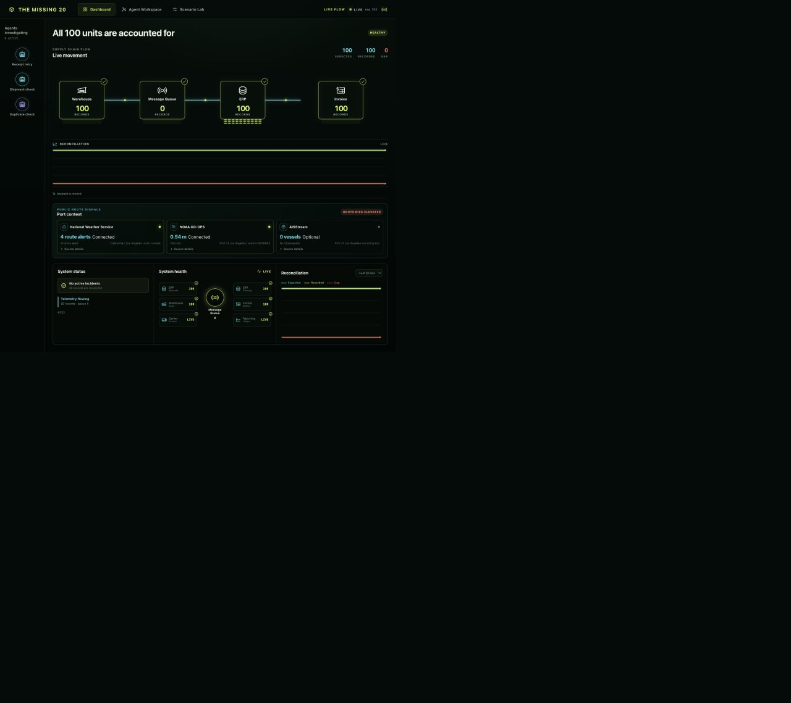
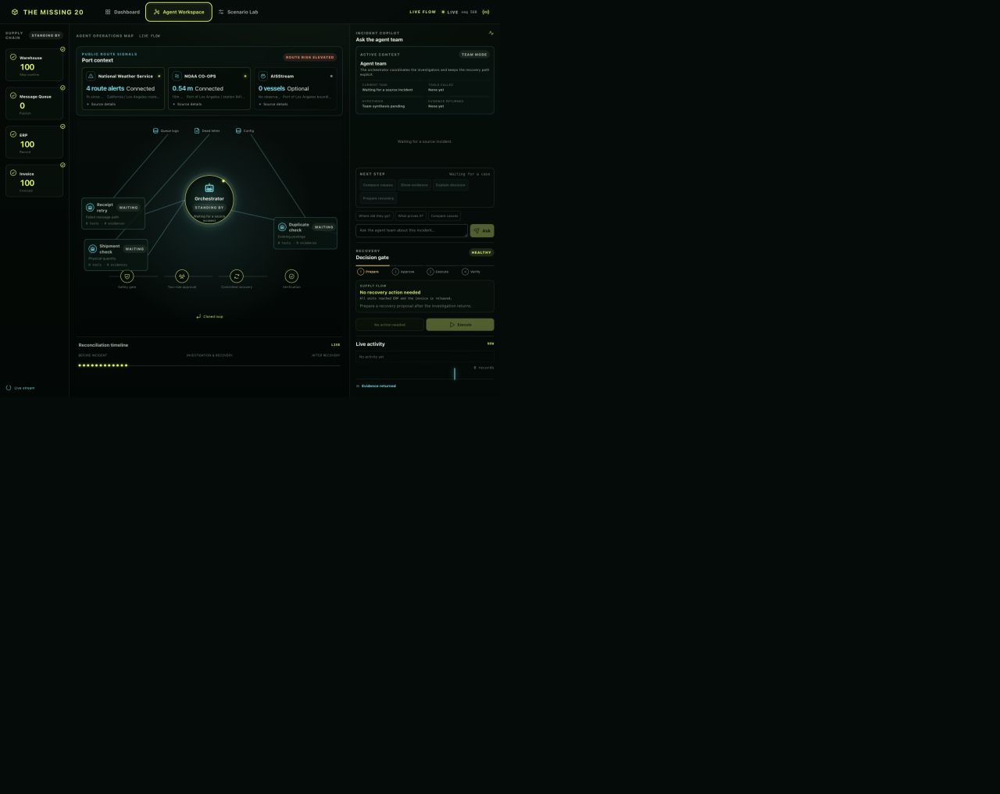
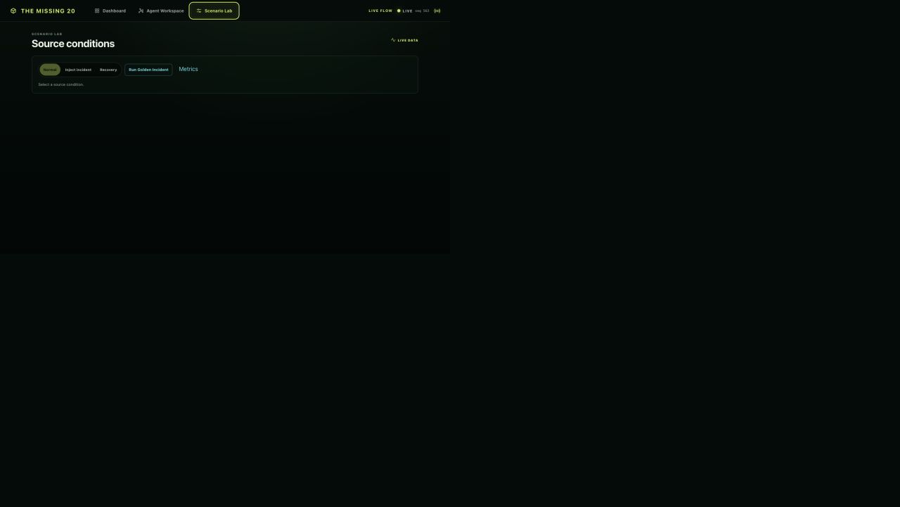
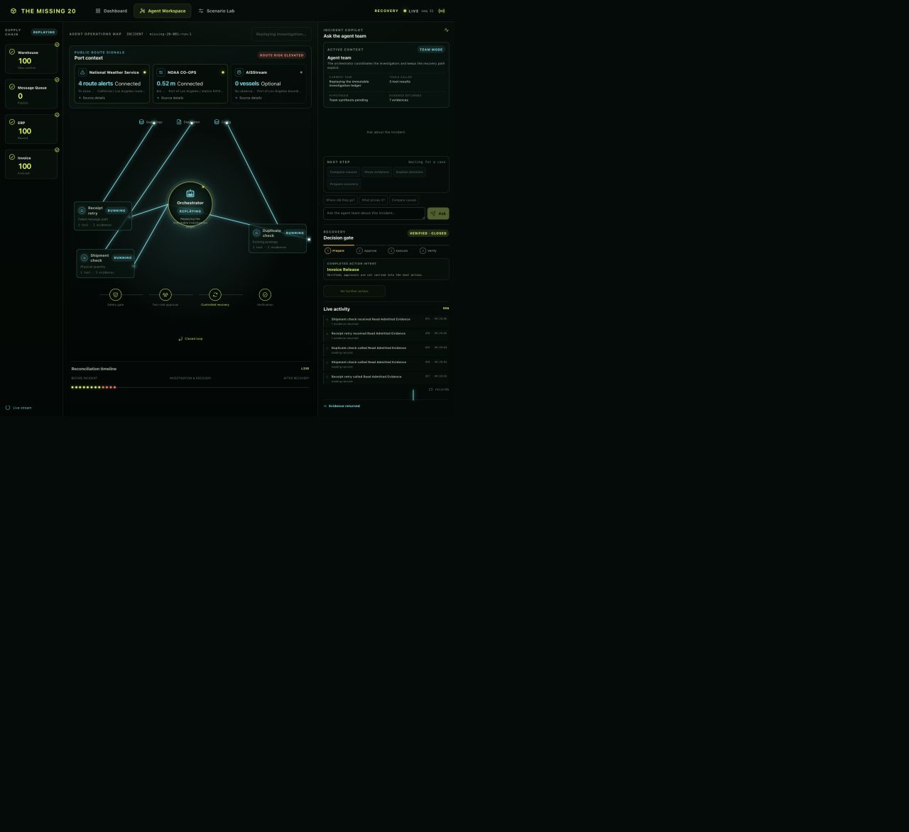
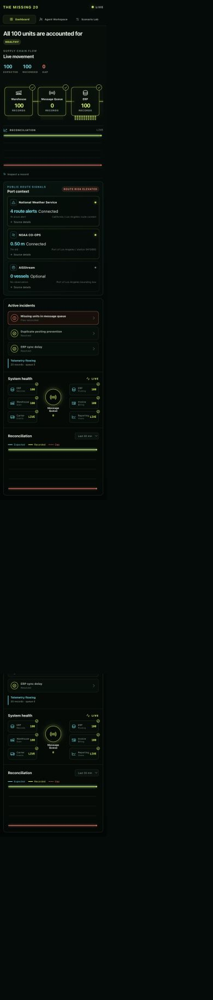

# The Missing 20: award-level product audit

Date: 2026-08-29
Reviewer: **Enterprise AI Operations Product Judge** — a deliberately strict composite persona: former incident commander, supply-chain control-tower product lead, observability UX reviewer, and Devpost Stage-Two judge. The reviewer rewards a demonstrable end-to-end outcome, visible agent work, operational truth, and a five-minute story. It does not reward technical labels, decorative motion, or controls without a useful state change.

## Loop contract

- **Goal:** decide whether the current interface communicates a credible, award-level live supply-chain investigation product and provide one bounded redesign Luna can implement.
- **Inputs:** current product at `127.0.0.1:8765`, current repository, official competition and product sources, and fresh screenshots from this run.
- **Checks:** desktop and 390 px flows; every visible control type; normal, active, replayed, and closed states; chat, role selection, citations, provenance, console, keyboard behavior, and API/UI agreement.
- **Feedback rule:** only reproducible award-impacting defects become P0/P1 work. Optional polish is P2 and must not create a review loop.
- **Stop:** report contains evidence, screenshots, tested matrix, score, prioritized findings, bounded diagram design, control/copy inventory, and Luna acceptance checks.

## Evidence and confidence

The prior Research Engine run was medium-confidence but incomplete: it retained only two eligible high-quality rows and warned that primary-source and current-evidence facets were missing. I therefore used it only as a lead and supplemented it with the official sources below.

| Source | What it establishes | Confidence |
|---|---|---:|
| [Agents for Humans official rules](https://agentsforhumans.devpost.com/rules) | Stage Two equally weights technical implementation, complete/coherent design, credible impact, originality, and an easy-to-follow end-to-end presentation. A live demo and/or AgentCore deployment strengthens technical implementation. | High |
| [Datadog Bits Investigation](https://www.datadoghq.com/product/ai/bits-investigation/) and [investigation docs](https://docs.datadoghq.com/bits_ai/bits_investigation/investigate_issues/) | Strong agent-incident products start automatically, explore competing causes, expose a real-time reasoning record, cite evidence, support chat, and can conclude “inconclusive.” | High |
| [FourKites Intelligent Control Tower](https://www.fourkites.ai/platform) | A control tower is more than an alert dashboard: it connects signal, impact, agent reasoning, execution, and decision trace in a closed loop. | High |
| [project44 real-time visibility](https://www.project44.com/platform/visibility/) | Supply-chain visibility depends on a trusted real-time data graph and predictive context, not isolated status cards. | High |
| [Grafana dashboard best practices](https://grafana.com/docs/grafana/latest/visualizations/dashboards/build-dashboards/best-practices/) | A dashboard should answer one question, tell a general-to-specific story, use meaningful color, direct browsing, and reduce cognitive load. | High |
| [AWS AgentCore / Strands harness](https://aws.amazon.com/blogs/machine-learning/get-to-your-first-working-agent-in-minutes-announcing-new-features-in-amazon-bedrock-agentcore/) | A strong Strands story makes tools, custom orchestration, multi-agent coordination, durable state, and controlled execution legible. | High |

Coverage limit: I did not establish a reliable, comparable corpus of prior winning Devpost repositories and videos in this bounded pass. Competition-specific conclusions therefore come from the current official rules, not inferred winner aesthetics. Confidence in the rubric is high; confidence in cross-winner visual comparison is low.

## Fresh evidence

1. **Dashboard, normal state** — visually coherent topology, but the reconciliation charts are nearly flat and public route signals remain cards rather than data stories.

   

2. **Agent Workspace, idle state** — agent roles and the safety lifecycle exist, but the page is text-heavy and the main work is not legible until a case or replay is loaded.

   

3. **Scenario Lab** — clear separation from the product surface, but it is too sparse and currently fails to communicate server truth when another incident is active.

   

4. **Agent replay** — the strongest screen: parallel investigators, handoffs, safety gate, decision gate, live activity, and replay are visible. The right rail still reads as a report and contains redundant or weak interactions.

   

5. **390 px Dashboard** — no horizontal overflow was observed, but the mobile information density is excessive and most interactive targets are too small for reliable touch use.

   

## Tested-flow matrix

| Surface / control | Observed result | Health |
|---|---|---|
| Dashboard, Agent Workspace, Scenario Lab tabs | Pointer navigation changes views. Dashboard-to-Agent shortcuts select the requested investigator. Arrow-right on the selected top tab did not change tabs in this run. | Needs repair |
| Normal Dashboard SSE | Sequence advanced continuously, source cards updated, NWS and NOAA showed connected provenance, AIS showed optional/not configured, and console had no errors or warnings. | Good |
| Scenario `Inject incident` | UI showed **Normal** selected while `/api/v1/scenarios` reported `missing-20-001-run-1` active. Clicking appeared to do nothing; the server rejected a direct POST with `scenario_transition_required`, and the UI exposed no useful error. | P0 failure |
| Direct active-case open | Current catalog incident loaded by its authoritative ID. Unknown/stale `run-2` is correctly not silently fabricated. | Good |
| Replay Investigation | Replayed the immutable ledger and visibly moved investigators through running/complete states with live event updates. | Strong |
| Four Agent nodes | Orchestrator and all three investigators were clicked. Mission, task, tools, hypothesis, evidence, selected state, and activity filter changed to match each role. | Strong |
| Case actions | Compare causes, Show evidence, and Explain decision produced responses. Prepare recovery was correctly disabled for a closed case. | Good, copy issues |
| Suggested questions | All three produced responses. `Compare causes` duplicates a case action. On a closed case, “Where did they go?” answered “0 units” and “exact unit records none,” which is technically current-state truth but a poor historical answer. | Needs repair |
| Free-form Ask | Request for the **current recovery state** returned a generic safety statement instead of the actual closed/verified state. | P1 failure |
| Chat citations | Citation buttons were clickable, but the evidence drawer stayed closed; no clear visible state change followed. | P1 failure |
| Record dots | Sampled unit `001`; the visible record inspector did not present a detail after the click. There are 100 individual unit buttons in the accessibility tree. | P1 failure |
| Incident rows | Current row navigated to Agent Workspace. The two resolved rows were clickable but had no state change. | P1 failure |
| Reconciliation window | The select contains only one option, `Last 30 min`. | Remove |
| Live-source details | All three disclosures opened and showed observed/received times and official-source links. | Good |
| Responsive / touch | 390 px had no horizontal overflow. The sampled DOM contained 146 visible/interpreted controls; 143 were below 44 px in at least one dimension, dominated by 6×4 px unit dots. | P1 accessibility |
| Console | No console warnings or errors observed. | Good |

Repeated controls were tested by control type, not by clicking all 100 unit dots individually. No claim is made about screen-reader announcements or full WCAG conformance.

## Current score: 64 / 100

| Dimension | Score | Reason |
|---|---:|---|
| Data story and diagram quality | **12/20** | Strong visual language and topology, but only two Canvas charts, flat-looking trends, and no diagrammatic weather/water/vessel story. The viewer still has to read cards to understand risk. |
| Agent capability legibility | **13/20** | Parallel roles, tools, evidence, handoff, replay, and safety gates are visible. Free-form behavior is shallow and historical/current context is not consistently handled. |
| Real-time truth and provenance | **11/15** | SSE, sequence, NWS, NOAA, AIS state, and official links are real. Scenario UI and authoritative catalog disagree, which is unacceptable in a judged demo. |
| Interaction depth and usefulness | **8/15** | Role selection and core case actions work. Several visible controls are dead, redundant, or do not expose their result. |
| Information hierarchy and copy economy | **6/10** | Dashboard is materially better than the old report, but Agent Workspace contains roughly 615 visible words and repeated status, action, evidence, and source blocks. |
| Visual polish, motion, responsive | **7/10** | Consistent dark control-tower aesthetic and meaningful replay motion. Dense mobile layout and tiny marks undermine confidence. |
| Accessibility | **3/5** | Semantic tabs, regions, labels, skip link, and native details are present. Keyboard tab transition failed in this audit and target sizes are too small. |
| Competition and demo narrative | **4/5** | The detection → investigation → governed action → verification story is differentiated, but the Scenario Lab failure can break the first minute of a live demo. |

Verdict: **technically credible, visually promising, not award-ready yet**. The product has a strong core but still behaves like a dense forensic console rather than a judge-guided five-minute story.

## Prioritized findings

### P0 — direction and demo integrity

1. **Unify scenario truth before any visual expansion.** The server has an active run while the UI advertises Normal. One authoritative scenario state must drive Dashboard, Scenario Lab, URL, and available actions. A rejected transition must produce an inline error and recovery option, never a silent no-op.
2. **Make Dashboard answer one question:** “Where is flow breaking, what is the operational impact, and is an agent handling it?” The current page shows components and status, but the actual change-over-time and cause/risk relationship are too weak. Additional diagrams must replace text/card interpretation, not add another row of decoration.

### P1 — award-impacting

1. **Close the evidence interaction loop.** A citation click must open the drawer, focus the exact evidence, and show source, observation, claim supported, and integrity state.
2. **Make chat state-aware.** A closed-case question must answer from historical case state plus current state. “What is the current recovery state?” must return `Verified / Closed`, completed action, verification result, and citations. Fix `1 claims` and remove “exact unit records none.”
3. **Remove false affordances.** Resolved incident rows, the one-option time select, and unit dots that do not expose details must not look interactive.
4. **Reduce duplicate control surfaces.** Suggested questions duplicate case actions; System status duplicates System health; Port context appears on both views at full size.
5. **Fix mobile interaction scale.** Core touch targets must be at least 44×44 px. The 100 dots should be a visual density strip with keyboard-accessible drill-down, not 100 tiny buttons.

### P2 — bounded polish

- Translate raw ISO source times into local relative time with the exact timestamp in a tooltip/details row.
- Keep the latest 8 activity items visible and move the complete ledger behind “View full trace.”
- Use human labels in the primary UI (`ERP receipt`) and keep long evidence IDs in copyable technical details.
- Give keyboard focus the same visible highlight as pointer selection.

## Bounded professional diagram design

Do **not** add many unrelated charts. Ship exactly four coordinated diagrams on Dashboard, all driven by the same API/SSE cursor and selectable time window:

1. **Live order-flow topology** — Warehouse → Queue → ERP → Invoice. Edge width is throughput; pulse speed is event rate; red gap branch is missing quantity; node badges show backlog and freshness. This evolves the existing topology.
2. **Reconciliation trend** — expected, recorded, and gap over time with a shared incident marker and hoverable values. Replace flat decorative lines with real sampled history and honest “insufficient history” state.
3. **Flow health small multiples** — three compact aligned charts: queue backlog/lag, ERP posting rate, and invoice completion rate. Shared cursor makes cause and downstream impact visually correlatable.
4. **External route-risk timeline** — NWS severity bands, NOAA water level with threshold, and optional AIS vessel count/availability on one time axis. It must be explicitly labeled `External context` and never imply enterprise causality.

Agent Workspace keeps one graph rather than copying Dashboard charts:

5. **Investigation graph** — Orchestrator plus three investigators, current tool call, evidence count, handoff, and synthesis state. Beside it, show a compact competing-hypothesis confidence plot and evidence-coverage matrix only while an incident is active/replaying.

Interaction contract for all diagrams: hover/focus shows timestamp, value, unit, source, and freshness; click selects a time/entity and updates the other panels; keyboard arrows move the shared cursor; reduced-motion mode preserves state changes without continuous pulses.

## Button inventory

| Visible control type | Decision | Exact change |
|---|---|---|
| Product logo/home | KEEP | Reset to authoritative current scenario, not an assumed Normal snapshot. |
| Dashboard / Agent Workspace / Scenario Lab tabs | KEEP + REPAIR | Preserve; make arrow-key switching pass reliably and keep URL/state aligned. |
| Reconnect | KEEP | Show only after disconnect; include last successful event time. |
| Dashboard investigator shortcuts | KEEP | They correctly open Agent Workspace with that role selected. |
| 100 unit dots | MERGE | Render as non-button density/flow marks; expose anomalies and a short virtualized record list for drill-down. |
| Current incident row | KEEP | Continue opening the authoritative case. |
| Resolved incident rows | REPAIR or REMOVE | Open a real historical case detail, otherwise render them as non-interactive status rows. |
| Reconciliation `Last 30 min` select | REMOVE | Reintroduce only when at least two real windows exist. |
| Source details | KEEP + CONDENSE | Keep provenance; use friendly age first and exact timestamp inside. |
| Replay Investigation | KEEP | Rename `Replay case timeline`; show playback position and pause/seek. |
| Orchestrator + three investigators | KEEP | Current role selection is one of the product’s best interactions. |
| Compare causes / Show evidence / Explain decision | KEEP | Retain as state-aware actions. |
| Suggested question chips | MERGE | Keep only non-duplicate, context-specific suggestions below the input. |
| Free-form Ask | KEEP + REPAIR | Answer case state directly before repeating guardrails. |
| Citation buttons | REPAIR | Open and focus the evidence drawer with an obvious visible result. |
| Prepare / approval / execute / verify controls | KEEP | Remain deterministic and state-gated. Do not expose disabled stages as primary buttons. |
| Normal / Inject incident / Recovery | KEEP + P0 REPAIR | Derive selection and availability from server catalog; show transition progress/error. |
| Run Golden Incident | KEEP | One-click, deterministic five-minute demo path; never compete visually with normal scenario controls. |
| Metrics link | REMOVE from primary UI | Put raw metrics under Technical details or README; judges should see the product, not `/metrics`. |

## Copy inventory

| Major text block | Decision | Exact change |
|---|---|---|
| Dashboard hero and Healthy/Incident state | KEEP | One outcome sentence and one state badge. |
| Expected / recorded / gap | KEEP | Values and units only; let the diagram explain the relationship. |
| Port-context card descriptions | CONDENSE | Provider, value, severity/freshness; provenance in details. |
| System status + System health | MERGE | One health diagram; remove repeated “Telemetry flowing,” counts, and duplicated LIVE labels. |
| Footer mode/trace strings | CONDENSE | One provenance pill: `Synthetic enterprise flow · Live SSE · seq N`; trace ID in details. |
| Agent role mission/task/tools/hypothesis/evidence | KEEP + CONDENSE | One-line mission, current action, top tools/evidence count; full IDs in drawer. |
| Live activity | CONDENSE | Latest 8 events with expand-to-ledger. |
| Decision gate | KEEP | This is essential human-control evidence. |
| Repeated Port context in Agent Workspace | CONDENSE | One incident-relevant external-risk ribbon; link back to Dashboard for charts. |
| `NEXT STEP / Waiting for a case` | CONDENSE | Replace with one state-aware next action; remove if closed. |
| Scenario Lab instructions | KEEP | One sentence that explains injected enterprise data remains synthetic. |

## Luna acceptance criteria

The redesign is complete only when all checks below pass:

1. **Scenario truth E2E:** fresh load → Normal → Inject incident → active investigation → prepare/approve/execute/verify → Recovery → Normal. At every step the URL, selected Scenario Lab control, catalog `current`, Dashboard hero, and action availability agree. Rejected transitions show an inline error. No silent no-op.
2. **Four Dashboard diagrams:** all four specified diagrams are visible at desktop; each uses API/SSE values, not independent animation timers. Tests prove a new cursor changes plotted data and an unchanged cursor does not replay a “new data” pulse.
3. **Cross-panel cursor:** selecting a point/entity in one chart updates at least topology selection, the other time-series cursor, and a concise detail panel. Hover/focus exposes value, unit, source, observed time, received time, and freshness.
4. **Agent legibility:** replay or a live incident visibly shows three distinct investigators, each role’s tools/evidence, handoff to synthesis, competing hypotheses, deterministic safety gate, two-role approval, controlled action, and verification.
5. **Chat correctness fixtures:** automated browser tests ask current state, root cause, evidence, alternatives, and next action in active and closed cases. Answers must be state-correct, concise, cited, and grammatical. A closed case cannot answer “0 units / none” to the historical missing-units question.
6. **Citation closure:** clicking every displayed citation opens the evidence drawer and visibly focuses a matching evidence ID. Missing evidence fails closed with a visible message.
7. **No dead controls:** an automated inventory clicks one representative of every control type. Every enabled control produces a documented state change, navigation, expanded detail, or response. Resolved rows and filters are not buttons/selects unless implemented.
8. **Copy budget:** excluding chart axis labels, evidence IDs, and the ledger, Dashboard stays under 180 words and Agent Workspace under 350 words. No duplicate primary action label appears twice on one view.
9. **Responsive/accessibility:** 390, 768, 1280, and 1440 px have no horizontal overflow. Core interactive targets are at least 44×44 px. Top tabs and shared chart cursor work by keyboard. Focus is visible. Reduced-motion mode removes continuous pulses while preserving state updates.
10. **Truth/provenance:** enterprise data remains explicitly synthetic; NWS/NOAA/AIS remain external advisory context. The browser makes no direct third-party request. Official source, observed/received time, freshness, degraded state, SSE cursor, and API identity remain inspectable.
11. **Regression gates:** no console errors/warnings; full Python, JS, browser E2E, unknown-ID 404, complete/degraded/fail-closed, approval/execution/verification/replay, and remote-resource tests pass.
12. **Five-minute judge path:** a clean Golden run can be demonstrated without typing: problem and 20-unit gap in 30 seconds; visible agent investigation in 90 seconds; evidence and competing causes in 60 seconds; human-controlled action and verification in 90 seconds; impact/provenance and close in 30 seconds.

## Final decision

**REJECT_FOR_AWARD_SUBMISSION_PENDING_ONE_BOUNDED_UI_PASS.** The implementation is beyond a proof of concept and has a credible differentiator, but the current 64/100 experience can still fail at the scenario-entry gate and makes judges read too much to understand the data and agent value. Implement the four-diagram Dashboard, repair authoritative scenario state and evidence/chat closure, remove false affordances, then rerun this same rubric once. Do not expand beyond that pass.
