# Human Browser + AgentCore End-to-End Acceptance

Date: 2026-08-30

Environment: local product UI backed by the deployed AWS AgentCore Runtime

Incident: `missing-20-001-run-1`
Operator: primary controller acting through the visible browser with real clicks

## Acceptance contract

- Goal: prove that a human can initiate, observe, investigate, approve, execute, and verify one complete incident lifecycle.
- Inputs: the Scenario Lab source control, the persisted incident API, real AgentCore/Strands advisory execution, deterministic safety and execution controls.
- Human gates: two distinct approval roles before each controlled effect.
- Stop condition: incident is `CLOSED`, execution is `COMPLETE`, verification is true, and replay produces zero additional effects.
- Truth boundary: AgentCore is advisory and read-only; deterministic code owns authorization, effects, reread, and verification.

## Tested journey

```mermaid
flowchart LR
  A[Normal source] -->|Inject incident| B[20-unit source gap]
  B --> C[Deterministic detection]
  C --> D[3 AgentCore investigators]
  D --> E[Synthesis and evaluation]
  E --> F[Human chat and citations]
  F --> G[Prepare immutable action]
  G --> H[Two-role approval]
  H --> I[Controlled execution]
  I --> J[Authoritative reread]
  J --> K[Verification]
  K -->|Second controlled action| G
  K --> L[VERIFIED and CLOSED]
```

## Real browser actions and outcomes

| Surface | Human action | Observed result | Verdict |
|---|---|---|---|
| Scenario Lab | Select Normal, then click **Inject incident** | Persisted `missing-20-001-run-1` with a 20-unit queue-to-ERP gap | PASS |
| Agent Workspace | Open immediately after injection | `INVESTIGATING`; three specialist agents visibly ran tools and returned evidence | PASS |
| Live activity | Expand activity | Ordered tool, evidence, synthesis, and evaluation events with timestamps | PASS |
| Agent roles | Click Receipt Retry, Shipment Evidence, Duplicate Posting, and Orchestrator | Role context and available evidence changed for every agent | PASS |
| Chat | Ask Receipt Retry for status, proof, and next action | Real AgentCore call and citations returned, but the answer was too generic | PARTIAL |
| Chat | Ask Orchestrator to compare causes | Grounded verdict: retryable message supported; shortage and already-posted rejected | PASS |
| Recovery | Click **Prepare recovery** | Immutable Receipt Message Restart intent created | PASS |
| Approval | Approve as Integration operator and AP approver | Two-role quorum accepted | PASS |
| Execution | Execute Receipt Message Restart | Queue effect completed and authoritative state reread | PASS |
| Recovery | Prepare, approve, and execute Invoice Release | Second controlled effect completed | PASS |
| Verification | Observe final decision state | `VERIFIED · CLOSED`; Warehouse 100, Queue 0, ERP 100, Invoice 100 | PASS |
| Replay | Replay completed investigation | `replay_effect_delta = 0` | PASS |

## Provider and execution evidence

The persisted incident snapshot reports:

- provider: `agentcore`
- model: `agentcore-runtime`
- transport: `agentcore_invoke_agent_runtime`
- region: `us-west-2`
- runtime configured: true
- provider status: `COMPLETE`
- provider requests: 23
- input tokens: 44,355
- output tokens: 1,673
- advisory authority: `ADVISORY_NOT_OPERATIONAL_DECISION`
- selected hypothesis: `RETRYABLE_MESSAGE`
- advisory result: `PARTIAL`, with `AI_CITATION_CLOSURE_INCOMPLETE`
- execution status: `COMPLETE`
- verified: true
- controlled effects: 2
- replay effect delta: 0

The existing provider metadata reports no incremental charge for this Runtime invocation and retains the prior cumulative estimate of `$0.0814368`.

## Defects found

1. **Judge-demo timing is fragile.** The scripted path can complete before the judge opens Dashboard or Agent Workspace, leaving `0 active agents` and making a real run look static. The real AWS run is visibly dynamic only when the workspace is opened promptly.
2. **One free-form answer is not sufficiently responsive.** Receipt Retry returned grounded citations but did not directly answer the requested status, exact proof, and next human action. Orchestrator's cause-comparison answer was substantially better.
3. **Scenario Lab has stale helper copy.** It can say “Select a source condition” after a condition has already been selected.
4. **Provider truth needs one endpoint check.** The application health contract must not report provider calls as false while AgentCore is configured and being invoked.
5. **AI advisory is honestly partial.** Deterministic operational closure passed, but the real advisory snapshot still records incomplete AI citation closure. Submission language must not claim fully proven stable AI usefulness.

## Primary verdict

`CONDITIONALLY_READY`

The core incident-to-verified-recovery lifecycle is real and passed with a deployed AgentCore Runtime. Final delivery should wait for an independent browser replay and bounded fixes to the demo pacing, direct-answer chat quality, stale Scenario Lab copy, and provider-health truthfulness. No schema or authority rebaseline is required.
